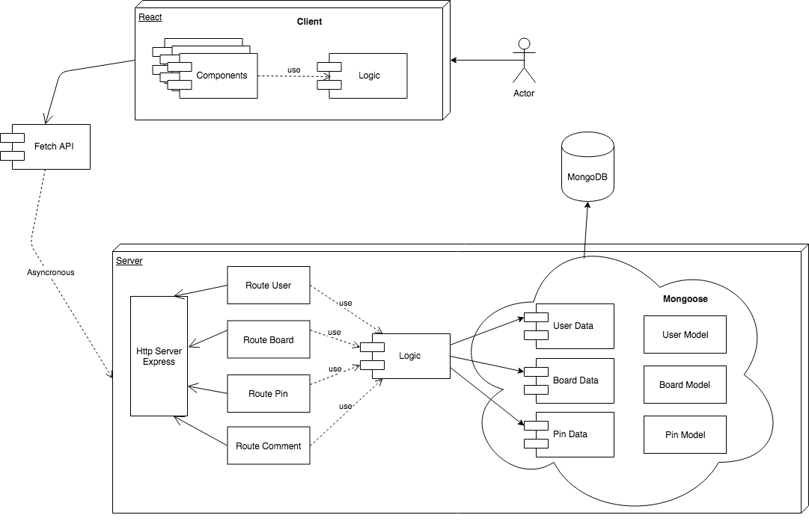

# Pinclonerest

Pinterest is an image sharing platform that allows users to create and manage image collections such as events, interests, hobbies and much more on personal thematic dashboards.

## Technologies

### Backend

JavaScript, NodeJs, Express, MongoDB, Mongoose, JWT, Webpack, TDD -Mocha-

### Frontend

ES6, React, SASS, Webpack, Babel, TDD -Mocha-

## Functional description

### Description

#### Register

Fields to register:

- email _**required_
- password  _**required_
- age _**required_

#### Login

Fields to login:

- email
- password

#### Navbar

Search for pins by title or description.

#### Wall

This is where you'll find all the most recent pins saved.

#### Profile

Page with the user's details:

In the header there must be

- Avatar picture
- Username
- Number of followers
- Number of followings

And in the bottom part separated by tabs

_Pins_
List of pins uploaded by the user

_Boards_
Boards created by the user where to save the pins

#### Settings

_Edit profile_

- Avatar picture
- username 
- name
- surname

#### Pin

_Create_

A user can publish a pin with the next fields:

- image _**required_
- board _**required_
- title
- description
- url

_Comment_

A user can comment through the textarea comment on a pin.

The comments will be displayed in descending order of publication.

_Like_

A user can mark / unmark as a favorite a comment using the word Like/Liked.

To the right of the word you will see how many likes you have.

_Saved_

A pin can be saved from the select form in a pin. At the same time you can stop wanting to save it by pencil icon in a pin.

In the user profile you can see the list of saved pins.

### Use case

## Technical description

### Architecture

### API

[API Documentation](https://documenter.getpostman.com/view/6088504/RzfgopE6)

### Data model

