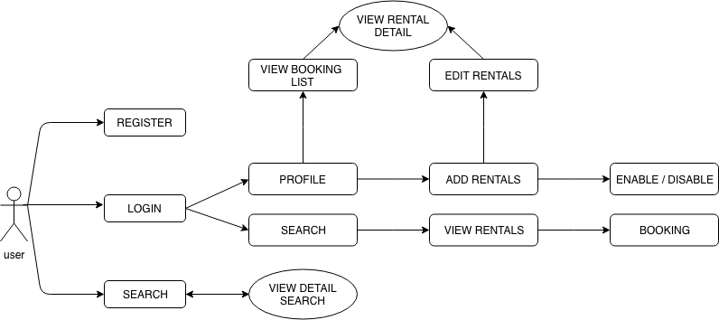
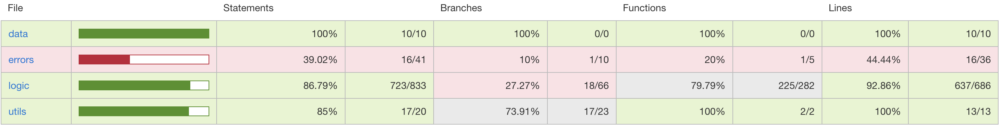
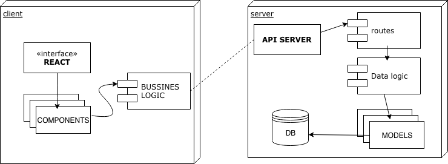
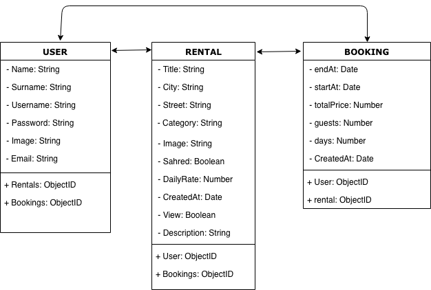

# BlueRooms

## Intro
This application is a booking portal for private apartments, where you can find other people's apartments and where you can also register your own apartments for rent

## Functional description
In BlueRooms allows the user to access thousands of rentals around the world.

Once registered and logged in, the user can search apartments by "city". By clicking on the results, you can find details of the rentals and generate bookings.

The user has a profile where they can also create their apartments to be rented, or consult their booking history. The user do not have the option to delete the apartment, but to hide it, to avoid future bookings.

## Landing screenshot

## Use Cases

## Technical description

The application is a web application that is meant to run within a browser environment. It consists of a ReactJS frontend with Reactstrap that connects to bluerooms API, where are the users, rentals and bookings data.
User, Rental and Booking data is persistent across page reloads, as local data is stored in the user's SessionStorage.

## Api Test

## Block Model

## Data Model

